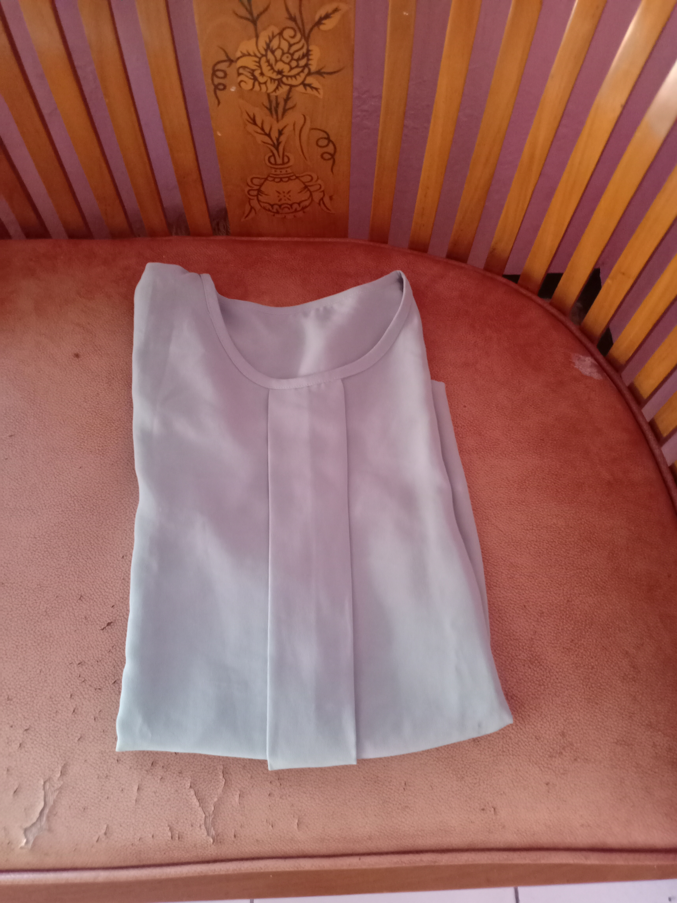
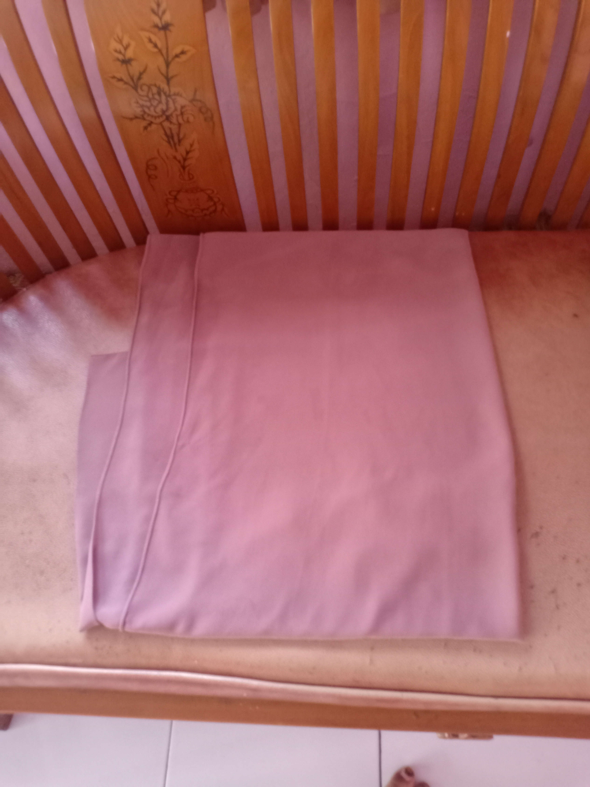
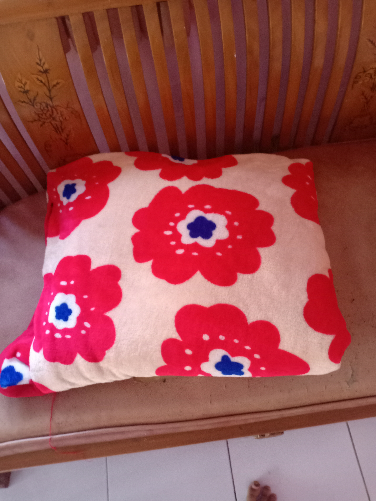

# Laporan Praktikum Pertemuan 1

## Nama : Luluk Mufida

## Kelas : TI-2C

## Absen/NIM : 11/1941720052

## output program

Hasil dari identifikasi benda yang dapat saya temukan di sekitar saya untuk dilaporkan sebagai tugas praktikum adalah :

1. Baju

2. Kerudung

3. Selimut

4. Kipas Angin

5. Televisi

## Penjelasan Program

1. Baju.java

pada class baju ini merupakan parent dari class kerudung dan selimut yang memiliki attribute warna, panjang dan lebar karena dari ketiga objek tersebut sama sama memiliki komponen tersebut.

2. Keurudung.java

class kerudung ini merupakan class yang inheritance terhadap class baju sehingga mewarisi seluruh attribute baju, kerudung memiliki attribute tambahan yakni jenis bahan dan bentuk karena kerudung memiliki jenis bahan yang berbeda beda mulai dari ceruty, diamond dan lain sebagainya, bentuknya pun banyak ada persegi empat, persegi panjang maupun instan.

3. Selimut.java

class selimut juga inheritance terhadap class baju namun memiliki attribute tambahan yakni motif dan ketebalan karena biasanya motif dari selimut bermacam macam begitupun dengan ketebalan dari selimut itu sendiri.

4. KipasAngin.java

pada class kipas angin ini dia berdiri sendiri tidak menjadi parent maupun class yang diwarisi, class ini memiliki attribute merek, jenis dan kecepatan yang dapat diatur menggunakan method sesuai dengan code diatas.

5. TV.java

class ini juga berdiri sendiri dengan memiliki attribute LCD, volume yang dapat dinaikkan atau diturunkan, dan juga ukuran dari layar tv yang biasanya memiliki satuan inch.

6. Tugas1.java

class ini merupakan tempat main atau pemanggilan sekaligus pembuatan objek untuk menampilkan isi dari kelima class diatas yang telah saya buat.

