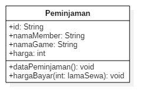

# Laporan Praktikum Pertemuan 2

## Nama : Luluk Mufida

## Kelas : TI-2C

## Absen/NIM : 11/1941720052

## output program

1. Soal 1 Membuat class diagram

class diagram ini memiliki 4 attribute yang public bisa digunakan di class lain dan juga 2 method public yang salah satu dari method tersebut memiliki 1 parameter yakni lamaSewa.

2. Soal 2 Source code dari soal 1

3. Soal 3 class lingkaran

4. Soal 4 class barang

## Penjelasan Program

1. Peminjaman.java

class ini memiliki attribute id, nama member, nama game, dan juga harga. di dalam class ini juga terdapat method menghitung total harga yang harus dibayar dengan rumus harga dikali lama sewa dari game tersebut.

2. PeminjamanMain.java

class ini berguna untuk memanggil dan membuat objek untuk class peminjaman.

3. Lingkaran.java

class ini memiliki attribute phi dan r yakni jari jari merupakan komponen utama atau bagian utama yang ada di rumus hitung keliling dan luas lingkaran sehingga dapat dipanggil didalam method hitung luas dan hitung keliling.

4. LingkaranMain.java

class ini berguna untuk memanggil dan membuat objek untuk class lingkaran.

5. Barang.java

class ini memiliki attribute kode, nama barang, harga dasar dan juga diskon dimana ada perhitungan harga jika terdapat diskon pada barang tersebut sehingga muncullah method hitung harga jual yang menghitung harga dari barang dikurangi diskon yang ada pada barang tersebut.

6. BarangMain.java

class ini berguna untuk memanggil dan membuat objek untuk class barang.

