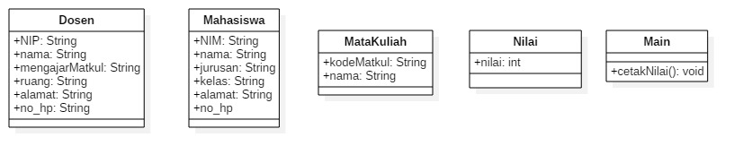

# Laporan Latihan Teori Pertemuan 2

## Nama : Luluk Mufida

## Kelas : TI-2C

## Absen/NIM : 11/1941720052

1. Memiliki 5 class yakni Dosen untuk data masing masing dosen yang bersangkutan, mahasiswa untuk data mahasiswa yang bersangkutan, matkul untuk data mata kuliah, nilai untuk mengisi nilai yang diberikan, dan class main untuk memanggil keempat class dengan membuat objek untuk mencetak nilai dari masing masing mahasiswa oleh masing masing guru yang bersangkutan

2. class Dosen memiliki attribute (NIP, nama, mengajarMatkul, ruang, alamat, no_hp), class Mahasiswa memiliki attribute (NIM, nama, kelas, jurusan, alamat, no_hp) class Matkul memiliki attribute (KodeMatkul, nama), class nilai memiliki attribute (nilai).

3. pada soal nomor 3 saya telah membuat class diagram dan juga mengeneratenya ke dalam file java yang berisi mengenai hitung luas dan keliling persegi.

