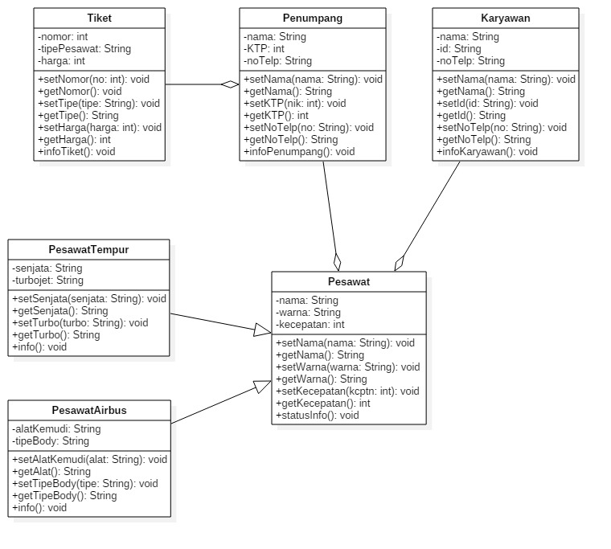

# Laporan Teori Pertemuan 4

## Nama : Luluk Mufida

## Kelas : TI-2C

## Absen/NIM : 11/1941720052

Diagram Class Pesawat

Diagram class pesawat diatas menjelaskan bahwa pesawat memiliki aggregation/ hubungan kepemilikan berupa penumpang dan karyawan kemudian penumpang juga memiliki aggregaion berupa tiket.

Selain itu pesawat juga memiliki inheritance yakni mewariskan atributenya kepada class pesawat tempur yang memiliki attribut unik berupa senjata dan juga turbojet, dan juga inheritance kepada class pesawat airbus yang memiliki attribute unik berupa alat kemudi yang berbentuk joystick serta memiliki beberapa jenis body yang berbeda beda.